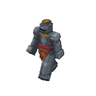
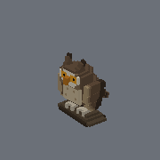
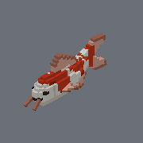
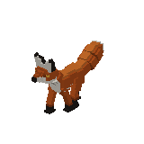
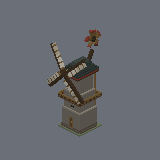
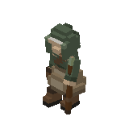
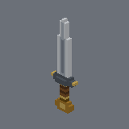

# Cuboidy

An open JSON file format for voxel character models, rigs, and animations.

**Status: v0.9 draft. See [SPEC.md](SPEC.md) for the formal specification.**

| | | | |
|:--:|:--:|:--:|:--:|
|  |  |  |  |
| **knight** — walk cycle | **owl** — wingbeat launch | **koi** — travelling body wave | **fox** — diagonal trot |
|  |  |  | |
| **windmill** — constant-rate sails | **herbalist** — laboured walk | **sword** — turntable, no clip | |

Every one of these was authored from [SPEC.md](SPEC.md) and
[`docs/geometry-authoring.md`](docs/geometry-authoring.md) alone, with no
example available to copy from. The turntables are `cuboidy-gif --orbit
--bg=none` output, unretouched.

## What it is

Cuboidy describes voxel characters as a hierarchy of rigid parts, with named attachment sockets and shareable keyframe animations. It combines ideas from several established formats:

- **Minecraft Bedrock** geometry/animation files — rigid part hierarchy, per-bone pivots
- **Mixamo** animation clips — cross-rig reusable animations bound by part name
- **MagicaVoxel** — voxel grid + inline palette
- **VRM** — named attachment points / standardized rig vocabulary (planned)

Every file is JSON. The format is designed to be:

- **Human-readable** — diff-friendly, editable in any text editor
- **AI-authorable** — structure favors generation reliability over byte efficiency
- **Browser-editable** — no proprietary binary, no native runtime dependencies
- **Self-contained** — no registry, no namespace lookups; everything resolves via filesystem

## At a glance

A complete Cuboidy model — one `cuboidy.json`, one `crown` part, 3×2×3 voxels, gold:

```json
{
  "name": "crown",
  "version": "0.9",
  "palette": ["#FFD700"],
  "parts": [
    {
      "name": "crown",
      "geometry": {
        "size": [3, 2, 3],
        "pivot": { "pos": [1, 0, 1] },
        "voxels": [
          ["000", "000", "000"],
          ["0.0", "...", "0.0"]
        ]
      }
    }
  ]
}
```

`voxels` is positionally indexed: one entry per Y-layer, one string per Z row,
one character per X cell. `.` is air; every other character is a palette index
(`0-9a-zA-Z`, hence the 62-colour cap). `size` is `[W, H, D]` and the arrays
must agree with it. See SPEC §7 for the full shape.

That is the whole file — no sibling `voxels.json`, nothing to reference. A part
can also point at a geometry file instead, which is what a model with many
parts usually does:

```json
{ "name": "head", "parent": "neck", "geometry": { "path": "body.json" } }
```

Both forms mix inside one manifest (SPEC §6.13). `cuboidy.json` is always
required — it is the anchor a loader looks for (§3); a lone geometry file has
shape but no rig, no animations and no name.

## Folder layout

A Cuboidy model is a folder anchored by `cuboidy.json`:

```
my-model/
├── cuboidy.json     manifest: rig hierarchy + published sockets + animations
├── voxels.json      voxel definition: palette + per-part grid + pivots + sockets
└── anims/           (optional) shared animations
    └── walk.json
```

`cuboidy.json` is the only fixed filename and the only required one.
Everything else is named freely and found by reference — so at the small end
the folder holds exactly one file, with every part's geometry written inline:

```
tiny-model/
└── cuboidy.json     manifest + all geometry — the whole model
```

For distribution, the folder can be packed into a single ZIP:

```
my-model.cuboidy        packed package (ZIP of the folder above)
```

| File | Role | Format | Validation |
|---|---|---|---|
| `cuboidy.json` | manifest (fixed name, **required**) | JSON | `parseManifest()` (TS reference impl) + shared JSON Schema (`schema/cuboidy.schema.json`) |
| `voxels.json` | voxel definition — optional, since a part may hold its geometry inline instead | JSON | `parseGeometry()` (TS reference impl) + shared JSON Schema (`schema/cuboidy-geometry.schema.json`) + `cuboidy-lint` CLI |
| `anims/*.json` | optional shared animations | JSON | same inline-animation schema + semantic rules (§6.6), resolved and checked by lint and the inspection CLIs |
| `*.cuboidy` | packed package | ZIP | both, after extraction; the archive itself is specified in §13 |

## The example models

- `models/knight/` — 18 parts over three geometry files sharing one palette; publishes two sockets, `weapon` and `crest`
- `models/sword/` — single-part accessory, authored against the knight's grip contract without seeing the knight
- `models/owl/` — segmented wings whose shoulder / mid / tip lag by a sixteenth of a cycle
- `models/koi/` — five body segments carrying a phase-delayed swimming wave
- `models/fox/` — quadruped on a diagonal gait, with a five-segment brush tail
- `models/windmill/` — manifest `geometry` list + shared `palette.json` (§6.9/§7.4); two constant-rate rotations in one clip
- `models/herbalist/` — 21 voxels tall, where placement matters more than detail

## Inspecting models

Five CLIs assemble a model and report on it. Four show the rest pose;
`cuboidy-gif` is the one that shows a clip in motion.

Rest rotations (`rotation`, `pivot.rot`) are handled two ways: `cuboidy-snap`
and `cuboidy-gif` draw them as truly oriented cubes, while the integer-lattice
tools (`cuboidy-view` / `cuboidy-query`) put a rotated part's pivot exactly
where the rig puts it but keep the part's own voxels axis-aligned, and emit a
warning saying so.

- **`cuboidy-snap <dir>`** — renders the model to **PNG images from several angles** (a contact sheet plus one PNG per angle), with the angle name and an XYZ axis gnomon baked into each. It is the image counterpart of `cuboidy-view`; the intended workflow is to render a model, look at the pictures, and refine the voxels. Dependency-free — a small software rasterizer + pure-Node (`zlib`) PNG encoder, no browser or native bindings.

  ```
  cuboidy-snap models/fox                       # → models/fox/snapshots/{contact,front,…}.png
  cuboidy-snap models/fox --angles=cardinal --size=512
  ```

  The default is the seven-view **standard** set: four three-quarter corners from above plus front / right-side / top. Other groups: `cardinal` (six faces), `corners` (four), `all`; or list ids directly (`front back side left top bottom fr-up fl-up br-up bl-up`).

- **`cuboidy-view <dir>`** — orthographic projections as **ASCII grids** of palette-index characters (the `voxels.json` alphabet), for a token-cheap textual read.
- **`cuboidy-query <dir> --at=x,y,z`** — exact voxel lookup at world coordinates (fractional-safe; the precise tool when half-voxel offsets are present).
- **`cuboidy-lint <dir>`** — voxel-definition + cross-file lint.

- **`cuboidy-gif <dir>`** — renders an animation clip to an **animated GIF**, optionally orbiting the camera around the model. The only way to see the half of the format that moves. The scale is fitted once to the whole clip *and* every viewpoint it will be seen from, so the model never rescales between frames and a foot's height can be compared across them. Same dependency-free policy as `cuboidy-snap`: software rasterizer plus a hand-rolled GIF encoder.

  ```
  cuboidy-gif models/knight                          # → models/knight/knight-walk.gif
  cuboidy-gif models/knight --orbit --loops=4        # walk four times while turning once
  cuboidy-gif models/sword --orbit                   # turntable — no animation needed
  cuboidy-gif models/owl --anim=launch --angle=side --fps=20 --size=240
  ```

  `--orbit` sweeps a full turn over the GIF, so it closes seamlessly; `--loops` lets the clip repeat under one revolution, because otherwise a one-second walk spins the camera a full turn per second. A model with no animation at all is still a valid subject with `--orbit`. `--bg=none` writes a transparent background — coverage is taken from the depth buffer rather than by matching the background colour, so a model that happens to use that colour keeps its pixels instead of growing holes.

  Renders at one sample per pixel by default, which keeps a frame inside GIF's 256-colour table losslessly (a model draws in 37–82 colours) and suits voxel art. `--ss=2` antialiases and quantises instead.

A sixth CLI writes rather than reads:

- **`cuboidy-part`** — author concrete geometry (the way symmetric limbs / repeated parts are made — an AI generator runs this instead of hand-writing mirrored voxels):
  - `cuboidy-part duplicate <from.json> <fromPart> <to.json> <toPart>` — copy a part (cross-file copies remap the palette so colors are preserved).
  - `cuboidy-part mirror <file.json> <part> [axis]` — reflect a part **in place** across `axis` (default `x`). A bilateral pair is *duplicate, then mirror the copy*.

## Token cost

Cuboidy is meant to be cheap to send to an LLM, but not by shrinking the file.
In a real authoring turn — spec in, model out — **reasoning is 77-93% of the
output cost**; the geometry file is around 7%. A 30-50% difference in file size
therefore moves the bill by single digits, which is why Cuboidy uses plain JSON
instead of a denser bespoke syntax.

The efficiency work that pays off is elsewhere: the voxel-row alphabet keeps a
grid at one character per cell, and `cuboidy-view` / `cuboidy-query` let a model
inspect a model without re-reading the whole file.

*(This replaced a `.cvox` text format in 2026-07, after measurement:
the size advantage was real but immaterial next to reasoning, a blind pairwise
vote over four briefs went 4-0 for JSON, and one non-Claude model could not
produce the text format at all. Four judged pairs is a small sample — it shows
the text format never demonstrated its claimed advantage, not that JSON
generates better models. Harness and raw votes are in git history, `b139ef4`.)*

## Roadmap

Done — the v0.9 spec and a complete TypeScript implementation of it
(`ts/packages/core/`, 536 tests):

- [x] Reference parser, canonical serializer (a verified byte-level fixed point
      on every shipped model), and manifest validation
- [x] Shared project loader (`resolveProject`) behind lint, the CLIs and the
      editor, so all three read a package the same way
- [x] Lint — `lintGeometry` (W01–W05, H01–H02) plus cross-file
      `validateProject` (part matching, duplicate names, palette resolution and
      range, animation targets, published-socket resolution, W06 l/r symmetry,
      W07 unreferenced file)
- [x] JSON Schemas for both file kinds, generated from the same Zod schemas the
      runtime uses, plus shared `fixtures/` as the cross-implementation contract
- [x] Inspection CLIs — `cuboidy-view` (ASCII), `cuboidy-query` (coordinates),
      `cuboidy-snap` (PNG stills) and `cuboidy-gif` (animated GIF and
      turntables), all dependency-free

Shipped alongside it:

- [~] **Web-based editor** (`ts/packages/editor/`) — loads a model folder, a
      single `cuboidy.json` or a `.cuboidy` ZIP; Geometry / Rig / Anim views;
      part, palette and keyframe editing with undo/redo; direct manipulation
      in the 3D preview;
      core's lint live in the Console panel; project-aware save/export;
      Playwright E2E suite. `cd ts/packages/editor && npm run dev`
      (Remaining polish — dirty-state guard, timeline zoom, a11y — was tracked
      in `docs/ux-backlog.md`, removed in `b110ec7`; read it with
      `git show b110ec7^:docs/ux-backlog.md`.)

Open, roughly in the order the work is worth doing:

- [ ] **Composition, above the format.** A package can now state what it
      offers: sockets are declared per part, and the manifest's `sockets` map
      (SPEC §6.12) publishes the ones consumers may use, under model-level
      names — `knight` publishes `weapon` and `crest`. What no package can say
      is *what goes in one*. `models/sword` was authored blind against the
      knight's grip contract and fits perfectly, but proving that took a
      hand-built merge of the two packages, because no tool composes them.
      That last piece is deliberately **not** going into the format: an
      attachment is a property of an arrangement of several models — a scene —
      and a model file should not have to know where it is used. It belongs to
      a layer above, which would own the scene file and reference models
      through their published sockets. `--attach` for `cuboidy-snap` /
      `cuboidy-gif` becomes possible once that layer exists.
- [ ] **Swept-volume checking.** Lint sees the rest pose; a render shows one
      frame. A part that passes *through* another while moving is invisible to
      both. The knight's thigh swung through its surcoat, found only by
      scripting an intersection count over the cycle; the windmill's sail tips
      clear its gallery by about two voxels, which its author could establish
      only by hand trigonometry. This is the one defect class the documented
      author's loop cannot catch.
- [ ] **Rig vocabularies** (quadruped / biped / winged / …). §6.8 binds a
      shared animation to parts *by name*, which makes the naming convention
      the interoperability surface — and it is currently unwritten. The W06
      symmetry check only recognises `<base>-l` / `<base>-r`, so the
      `leg-fl` style the spec's own examples used gets no check at all. A
      vocabulary would settle both.
- [ ] **Reference parser (C#).** The shared `fixtures/` corpus exists for
      exactly this: a second implementation passes when every fixture yields
      the diagnostic code its directory is named after.

## License

[MIT](LICENSE). The reference parser, examples, and specification are released
under the MIT license. Implementations in any language are encouraged.
